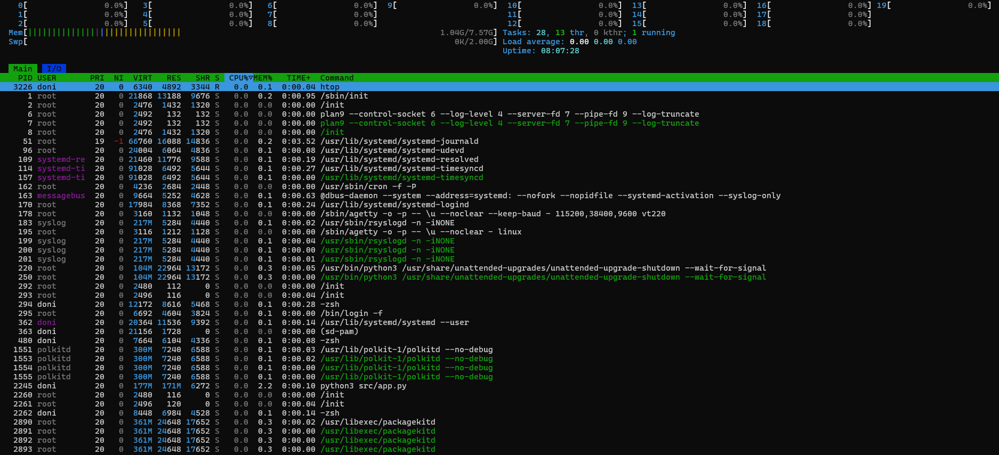
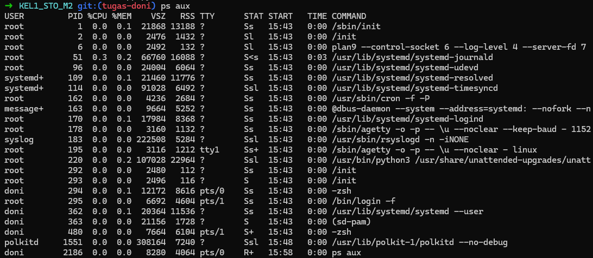

# Laporan Analisis Proses Sistem Operasi
**Nama:** Haradoni Aria Prima  
**NIM:** 224443033  
**Peran:** Process Analyst (Tugas 3)  
**Tanggal Observasi:** 7 April 2026  

---

## 1. Pendahuluan
Tujuan dari analisis ini adalah untuk mengamati bagaimana Sistem Operasi Linux (melalui WSL) merepresentasikan sebuah file kode program (`src/app.py`) menjadi sebuah entitas hidup yang disebut **Proses**. Analisis dilakukan menggunakan tools standar Linux seperti `ps aux` dan `htop`.

## 2. Hasil Observasi Eksekusi
Berdasarkan eksekusi aplikasi Python yang dikembangkan oleh Lead Developer, berikut adalah data mentah yang diperoleh dari sistem:

### A. Identitas Proses (via `ps aux`)
Pada saat aplikasi dijalankan, perintah `ps aux` memberikan output sebagai berikut:
- **USER:** `doni` (Proses berjalan di bawah hak akses user lokal).
- **PID:** `2245` (Process ID unik yang dialokasikan oleh Kernel).
- **COMMAND:** `python3 src/app.py`
- **START TIME:** `15:59`

### B. Monitoring Resource (via `htop`)
Melalui tampilan antarmuka `htop`, ditemukan detail penggunaan sumber daya yang lebih mendalam:
- **CPU%:** `0.0` (Menunjukkan aplikasi dalam kondisi idle/waiting, tidak membebani prosesor).
- **MEM%:** `2.2` (Persentase penggunaan RAM fisik terhadap total kapasitas).
- **RES (Resident Memory):** `171M` (Jumlah memori fisik yang benar-benar dikonsumsi proses).
- **VIRT (Virtual Memory):** `177M` (Total ruang alamat virtual yang dipesan proses).

---

## 3. Analisis Mendalam (Core Analysis)

### Bagaimana OS Merepresentasikan Aplikasi?
Sistem Operasi tidak melihat `app.py` sebagai sekadar file teks, melainkan sebagai **Task**. Kernel Linux membuat sebuah struktur data bernama `task_struct` di dalam memori untuk menyimpan semua informasi di atas (PID, User, Resource). 

### Analisis State (STAT)
Pada screenshot `ps aux`, kolom **STAT** menunjukkan kode `S` (Interruptible Sleep). 
- **Analisis:** Hal ini terjadi karena aplikasi kita bertindak sebagai server/logger yang menunggu instruksi selanjutnya. OS sangat efisien; daripada membiarkan aplikasi memakan CPU secara terus-menerus (Busy Waiting), OS menempatkan proses 2245 ke dalam *Wait Queue* sampai ada interupsi atau data baru yang harus diproses.

### Analisis Memori (Resident Set Size)
Meskipun aplikasi ini sederhana, penggunaan RAM sebesar **171MB** (RES) terdeteksi. 
- **Analisis:** Hal ini disebabkan oleh mekanisme aplikasi yang melakukan "Dummy Memory Allocation". OS merespons permintaan alokasi tersebut dengan memetakan halaman memori virtual ke RAM fisik (Resident). Ini membuktikan peran OS sebagai *Resource Allocator* yang menjamin setiap proses mendapatkan ruang memori yang terisolasi.

---

## 4. Bukti Observasi
Berikut adalah tangkapan layar (screenshot) sebagai bukti praktikum di lingkungan WSL:

*Gambar 1: Pemantauan proses melalui utility htop.*

*Gambar 2: List proses pada terminal Linux.*

---

## 5. Kesimpulan
Melalui praktikum ini, dapat disimpulkan bahwa:
1. Setiap proses di Linux memiliki identitas unik berupa **PID** (dalam kasus ini 2245).
2. Sistem Operasi melakukan isolasi sumber daya (CPU & RAM) untuk setiap proses agar tidak terjadi konflik antar aplikasi.
3. Alat seperti `htop` sangat krusial bagi administrator sistem untuk memantau kesehatan dan efisiensi penggunaan resource oleh sebuah proses secara real-time.
